<!-- BANNER — upload CVM_banner.svg to this repo as banner.svg -->
<p align="center">
  
</p>

<p align="center">
  &nbsp;
  &nbsp;
  &nbsp;
  <a href="https://python.org"></a>&nbsp;
  <a href="https://pytorch.org"></a>&nbsp;
  
</p>

---

## 📋 Table of Contents
- [Overview](#-overview)
- [Key Results](#-key-results)
- [Architecture](#-architecture)
- [Features](#-features)
- [Tech Stack](#️-tech-stack)
- [Installation](#-installation)
- [Usage](#-usage)
- [Pipeline Details](#-pipeline-details)
- [File Structure](#-file-structure)
- [Dataset](#-dataset)
- [Awards](#-awards)
- [License](#-license)

---

## 🎯 Overview

A full end-to-end computer vision pipeline for **orthodontic skeletal maturity assessment** from lateral cephalometric X-rays. The system automates a clinical workflow that traditionally requires ~15 minutes of manual measurement by an orthodontist, reducing it to **under 2 minutes** with comparable accuracy.

Given a cervical spine X-ray, the pipeline:
1. Segments the C2–C4 vertebrae using an **Attention U-Net**
2. Extracts **79 morphological features** from the segmented masks
3. Uses **SHAP** to select the most predictive features
4. Predicts **skeletal age** (XGBoost regression) and **biological sex** (Random Forest classification)
5. Serves results via a **Flask REST API** to a **React frontend** with live segmentation overlay

> 📸 **Demo:** *(drag-and-drop upload with live segmentation overlay — GIF coming soon)*

---

## 📊 Key Results

| Task | Model | Metric | Score |
|------|-------|--------|-------|
| Vertebrae segmentation | Attention U-Net | Dice coefficient | **0.94** |
| Skeletal age prediction | XGBoost | MAE | **5.87 years** |
| Gender classification | Random Forest | AUC / Accuracy | **0.912 / 84%** |

- **Dataset:** 1,294 clinical lateral cephalometric X-rays
- **Features extracted:** 79 morphological → SHAP-selected 23 (age) and 15 (gender)

---

## 🧠 Architecture

```
Lateral Cephalometric X-ray
          │
          ▼
  ┌───────────────────┐
  │  Attention U-Net  │  C2, C3, C4 vertebrae segmentation
  │                   │  Dice score: 0.94
  └───────────────────┘
          │
          ▼
  ┌───────────────────┐
  │  79 Morphological │  Height ratios, concavity indices,
  │  Features         │  vertebral body shape descriptors
  └───────────────────┘
          │
     ┌────┴────┐
     ▼         ▼
  SHAP        SHAP
  23 features 15 features
  (age)       (gender)
     │         │
     ▼         ▼
  XGBoost   Random Forest
  Regression Classification
  MAE: 5.87  AUC: 0.912
  years      84% accuracy
     │         │
     └────┬────┘
          ▼
  ┌───────────────────┐
  │  Flask REST API   │  /predict · /health endpoints
  └───────────────────┘
          │
          ▼
  ┌───────────────────┐
  │  React Frontend   │  Drag-and-drop upload · live segmentation
  │  (cvm-frontend)   │  overlay · gender confidence score
  └───────────────────┘
```

---

## ✨ Features

- **Attention U-Net segmentation** — automatically isolates C2, C3, C4 vertebrae with Dice score 0.94
- **79 morphological features** — height ratios, concavity indices, shape descriptors per vertebra
- **SHAP feature selection** — reduces overfitting by selecting only the most predictive features per task
- **Dual-output prediction** — simultaneous skeletal age regression and gender classification
- **Flask REST API** — `/predict` and `/health` endpoints for integration
- **React frontend** — drag-and-drop X-ray upload, live segmentation overlay, gender confidence score display
- **Clinical time reduction** — from ~15 minutes manual assessment to under 2 minutes

---

## 🛠️ Tech Stack

| Layer | Tools |
|-------|-------|
| Segmentation | PyTorch · Attention U-Net |
| Feature extraction | OpenCV · NumPy |
| Feature selection | SHAP |
| Age prediction | XGBoost |
| Gender classification | scikit-learn (Random Forest) |
| Backend API | Flask · Python |
| Frontend | React · Vite · Tailwind CSS |

---

## 🔧 Installation

### Backend

```bash
git clone https://github.com/ShettyShravya03/Machine-Learning-Driven-Skeletal-age-and-gender-prediction.git
cd Machine-Learning-Driven-Skeletal-age-and-gender-prediction

pip install -r requirements.txt
```

**Key dependencies:** `torch` `torchvision` `xgboost` `scikit-learn` `shap` `flask` `opencv-python` `numpy` `pandas`

### Frontend

```bash
cd cvm-frontend
npm install
```

---

## 🚀 Usage

### 1. Start the Flask backend

```bash
python app.py
# Server runs at http://localhost:5000
```

### 2. Start the React frontend

```bash
cd cvm-frontend
npm run dev
# App runs at http://localhost:5173
```

### 3. Use the API directly

```bash
curl -X POST http://localhost:5000/predict \
  -F "image=@/path/to/xray.jpg"
```

**Sample response:**
```json
{
  "skeletal_age": 14.3,
  "gender": "Female",
  "gender_confidence": 0.89,
  "segmentation_overlay": "<base64_image>",
  "shap_features_used": 23
}
```

---

## 🔍 Pipeline Details

### Stage 1 — Segmentation (Attention U-Net)

The Attention U-Net segments the **C2, C3, and C4 cervical vertebrae** from lateral cephalometric X-rays. Attention gates suppress irrelevant background activations and focus on vertebral body boundaries.

- **Input:** Grayscale X-ray (resized to 256×256)
- **Output:** Binary segmentation masks per vertebra — via `binarymask.py`
- **Dice score:** 0.94 on held-out test set

### Stage 2 — Feature Extraction

79 morphological features are computed from the segmentation masks via `feature extraction.py`:
- Vertebral body height and width ratios
- Concavity index of the inferior border of C2
- Ratio of anterior to posterior vertebral height
- Shape descriptors per C3 and C4 (rectangular → square → trapezoidal maturation stages)

### Stage 3 — SHAP Feature Selection

SHAP ranks feature importance and selects the top features for each task:
- **Age model:** Top 23 features → `age_pred.py`
- **Gender model:** Top 15 features → `gender_pred.py`

### Stage 4 — Prediction & Inference

| Script | Task |
|--------|------|
| `age_pred.py` | XGBoost skeletal age regression |
| `gender_pred.py` | Random Forest gender classification |
| `cvm_inference.py` | End-to-end inference pipeline |
| `unknown_pred.py` | Prediction on new unlabelled X-rays |
| `model comparison.py` | Baseline model benchmarking |

---

## 📁 File Structure

```
.
├── cvm-frontend/              # React frontend (Vite + Tailwind)
│   ├── src/                   # React components and app logic
│   ├── index.html
│   ├── package.json
│   ├── postcss.config.cjs
│   ├── tailwind.config.js
│   └── vite.config.js
├── LAST Dataset/              # Dataset directory (not tracked — see Dataset note)
├── app.py                     # Flask REST API entry point
├── cvm_inference.py           # End-to-end inference pipeline
├── age_pred.py                # XGBoost age regression
├── gender_pred.py             # Random Forest gender classification
├── unknown_pred.py            # Prediction on new unlabelled samples
├── feature extraction.py      # 79 morphological feature extractor
├── binarymask.py              # Vertebrae segmentation mask generation
├── model comparison.py        # Baseline model benchmarking
├── best_age_model_name.txt    # Saved best age model identifier
├── best_gender_model_name.txt # Saved best gender model identifier
├── .gitignore
├── LICENSE
└── README.md
```

---

## 📂 Dataset

Trained and evaluated on **1,294 lateral cephalometric X-rays** with ground-truth skeletal age and gender labels, collected in accordance with ethical guidelines for clinical research.

> **Note:** The dataset is not included in this repository due to patient privacy constraints. A similarly annotated dataset of lateral cephalometric X-rays with CVM stage labels is required to reproduce results.

---

## 🏆 Awards

**Best Project of the Year — Commendation Prize**
Issued by EXPRO 2025-26, NMAM Institute of Technology · April 2026

*Awarded at the Final Year Students' Project Exhibition & Competition for ML-Driven Skeletal Age & Gender Prediction using Cervical Vertebral Maturation.*

---

## 📜 License

MIT © 2026 Shravya S Shetty
